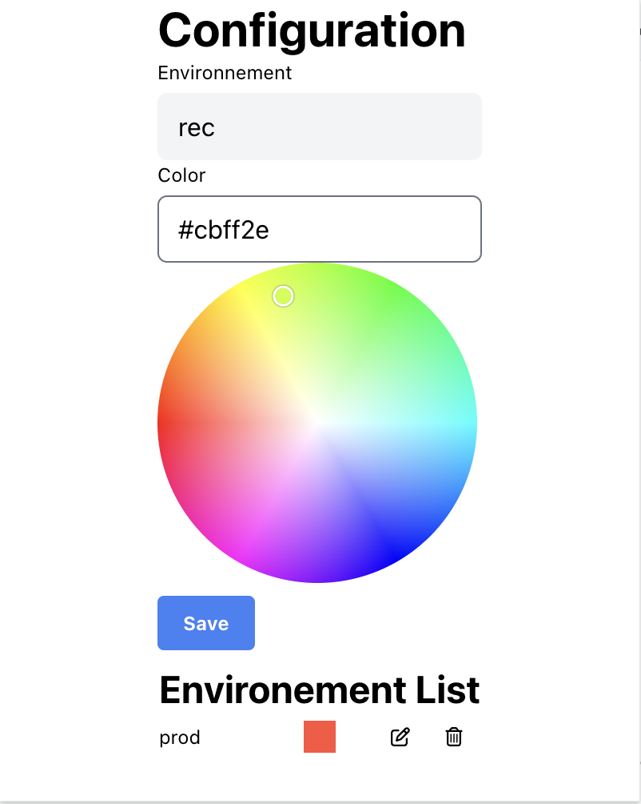

# AWS Change Color Profile

<!-- ABOUT THE PROJET -->

This Chrome browser extension provides a practical and aesthetic solution for frequent users of the Amazon Web Services (AWS) platform.

This extension allows users to customize the color of the AWS header based on the connected user profile.

You can customize the color and the profile name.

## Build with

- [![React][React.js]][React-url]
- [Craco][Craco-url]

## Available Scripts

In the project directory, you can run:

### `npm start`

Runs the app in the development mode.\
Open [http://localhost:3000](http://localhost:3000) to view it in the browser.

The page will reload if you make edits.\
You will also see any lint errors in the console.

### `npm run build`

Builds the app for production to the `build` folder.\
We use [craco](https://craco.js.org/) to package extension.

<!-- MARKDOWN LINK & IMAGES -->

[React.js]: https://img.shields.io/badge/React-20232A?style=for-the-badge&logo=react&logoColor=61DAFB
[React-url]: https://reactjs.org/
[Craco.js]: https://craco.js.org/img/craco.png
[Craco-url]: https://craco.js.org/
